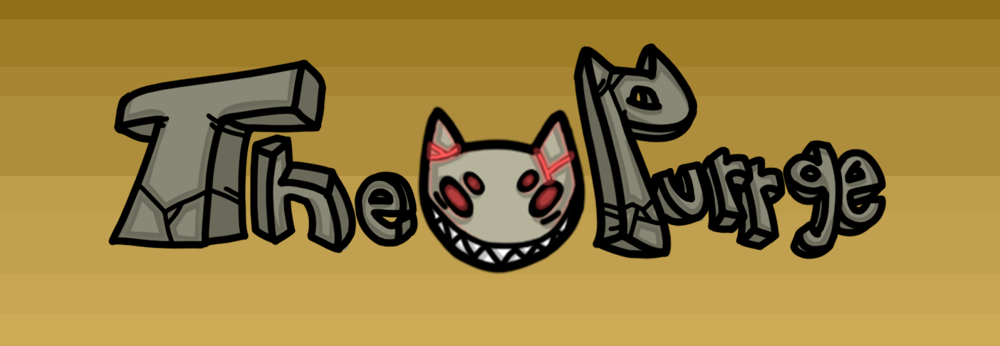

    

<h1 align="center">
	Meu Primeiro Jogo - The Purrge
</h1>

Jogo feito no final de 2018, pela engine Game Maker

  

  

  

## 📁 Projeto

Um jogo de plataforma.

## 🎮 Gameplay

Arrow keys: Movimentação  
Z: Atira

## 📄 História

Sempre fui apaixonado por jogos eletrônicos, então decidi que iria criar eu mesmo o meu próprio jogo. Foi assim, então que surge o The Purrge, feito por mim 
sem conhecimento nenhum de programação.

## 🚀 **Em constante evolução...**

---

Feito com ♥ by [Daniel Corona](https://www.linkedin.com/in/dnlcorona/)